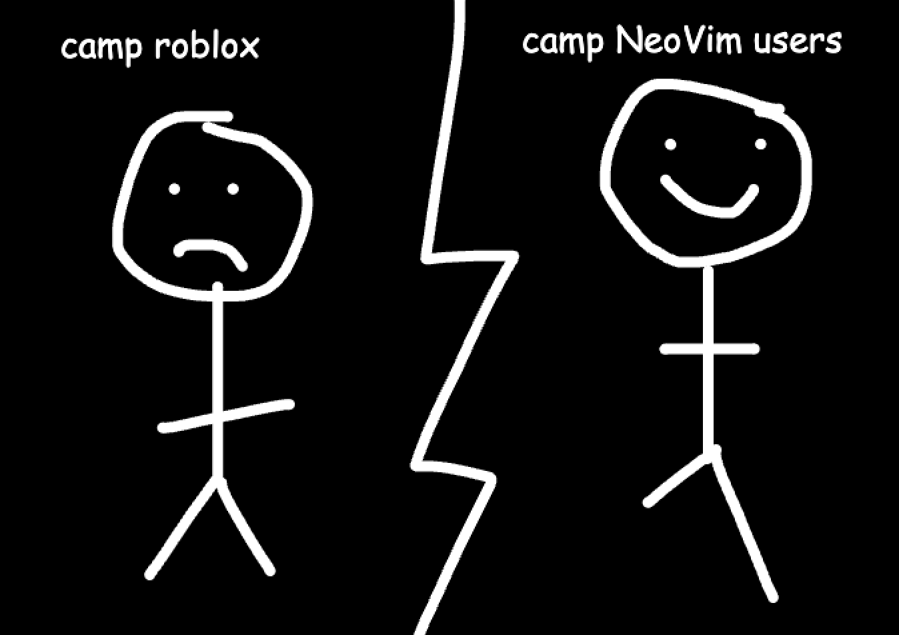

# Google Does Not Use Lua
It's very very rarely, if ever, used, sadly.

## Introduction
I started scripting in Lua when I was 11.

If you're not familiar with Lua, it is a neat and weird scripting language. It has:
- 1-indexed arrays (wtf?)
- no concept of OOP (double wtf??)
- one single data structure - a table (triple wtf???)
- Makes you write end at the end of every function. So your code ends up looking like this

```lua
-- loop check if thingys velocity is changed
while wait(1) do
	for x = 1, #descendants do
		if descendants[x].AssemblyLinearVelocity.Magnitude > 10 then
			addScript(descendants[x])
		end
	end
end
```
*This is [actual code I wrote when I was 14](https://github.com/milotek/CollisionSounds/blob/main/source/HitSound%20Handler.lua#L24-L31), by the way*.

## Lua's fate

Aside from the fun applications, it would appear we have two main remaining Lua users still active out in the wild:
1. Roblox Developers
2. NeoVim plugin authors



So, it would appear it's just a subset of NeoVim powerusers, and Roblox developers. So basically, just Roblox.

Ah, Roblox, a platform that was once filled with young pioneers, future engineers, and men destined to go on to do great things. It is currently, slowing, molting into a vibe-coding haven for techbros and pharmers to to create slop for prepubescent iPad kids. **Thank you, private equity, for kicking off the beginning of the end of something beautiful.**

Irregardless, Roblox has made a dedicated commitment to stick with Lua, or rather, their fork of the language - Luau. 

See: https://luau.org/why

<aside class="callout" data-callout="quote">
<p class="callout-title">Why Luau?</p>

Around 2006, [Roblox](https://www.roblox.com/) started using Lua 5.1 as a scripting language for games. Over the years the runtime had to be tweaked to provide a safe, secure sandboxed environment; we gradually started accumulating small library changes and tweaks.

Having grown a substantial internal codebase that needed to be correct and performant, and with the focus shifting a bit from novice game developers to professional studios building games on Roblox and our own teams of engineers building applications, there was a need to improve performance and quality of the code we were writing.

Unlike mainline Lua, we also could not afford to do major breaking changes to the language (hence the 5.1 language baseline that remained unchanged for more than a decade). While faster implementations of Lua 5.1 like LuaJIT were available, they didn’t meet our needs in terms of portability, ease of change and they didn’t address the problem of developing robust code at scale.

All of these motivated us to start reshaping Lua 5.1 that we started from into a new, derivative language that we call Luau.

</aside>

Luau is a modern edition of the language focused on making the language more performant and feature-rich. Luau makes it easier to write robust code through a combination of linting and type checking using a gradual type system.
