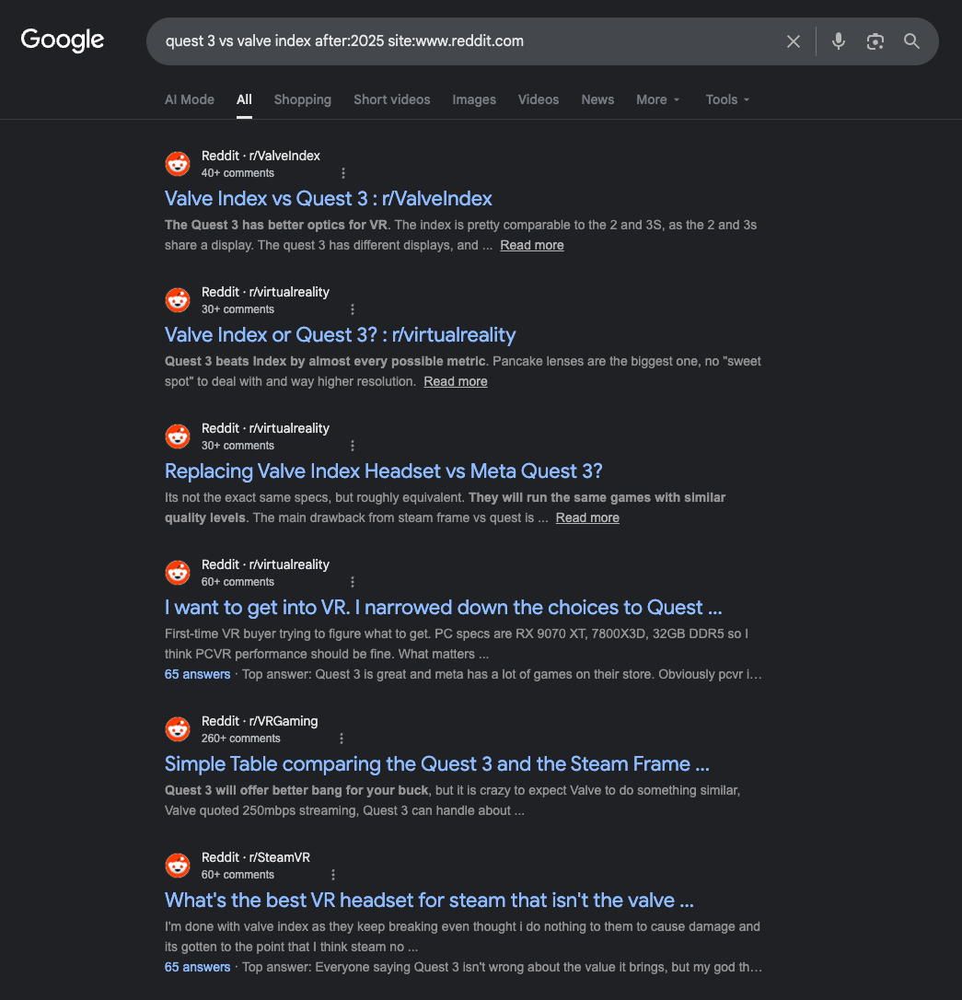
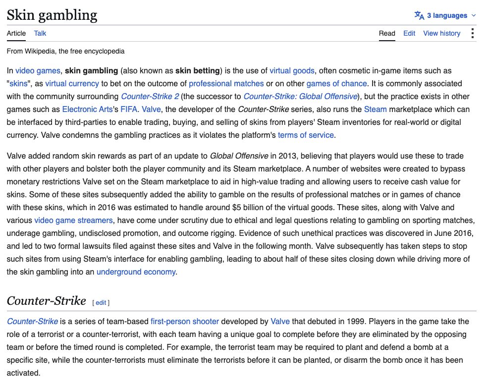
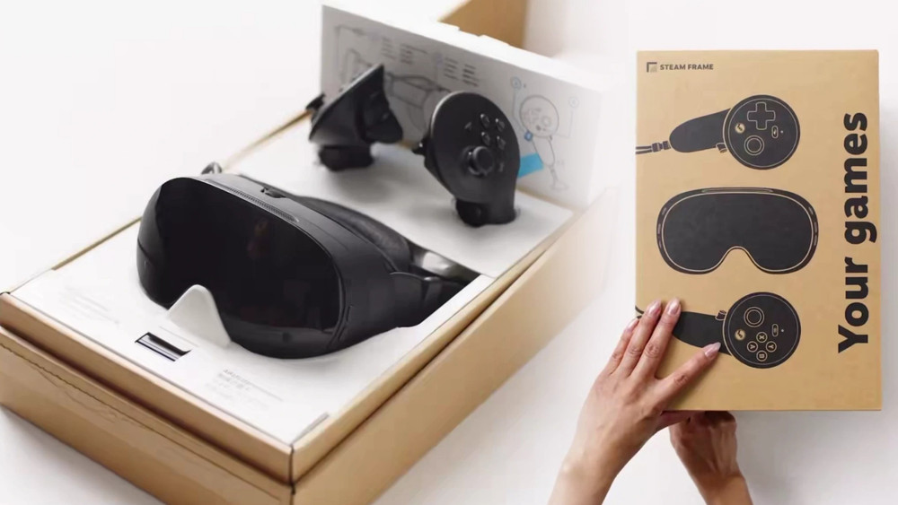
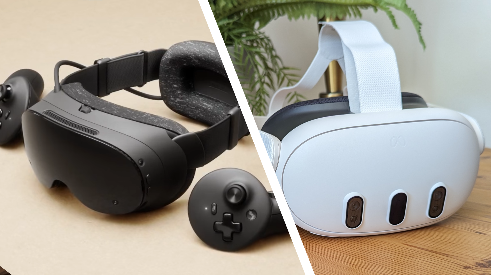

# Who the hell is the Steam Frame even for?
Do valve even know? 🤔
## Valve's history of headsets
Valve have a long and extensive history in VR. 

They practically pioneered the first "big boom" of consumer virtual reality by collaborating with HTC to make the [HTC Vive](https://en.wikipedia.org/wiki/HTC_Vive). But, we're discussing explicitly *their* headsets here, which are:

1. #Valve Index
2. #Steam Frame

### Valve Index
When it was released all the way back in 2019 (wow, time flies, huh), the Valve Index was **the** greatest virtual reality headset money could buy you - and it was a **damn good deal too!**
For just £950:
- The highest refresh rate on a HMD ever
- The sexiest controllers of all time
- Full finger tracking
- Pressure-sensitive grips
- Touch-capacitive buttons and triggers
- [Truely premium BMR audio](https://www.valvesoftware.com/en/index/deep-dive/ear-speakers)
- Gaming-first sofware made by competent engineers
- Gaming-first hardware made by competent engineers

Half of the above, arguably, still has not been topped. And this was in **2019**!

If it weren't for its unfortunate *(but unavoidable for the time)* shortcomings like...
- Base station tracking
- Fresnel lenses
- Low resolution (by today's standards) display

...it would still probably be my pick over the Quest 3.

Matter of fact, you will still find new Reddit threads of people debating if they should pick up a Q3 or a second-hand Index to this day.

If people have choice paralysis so bad between devices released 5 years apart that they make a Reddit thread about it, you know you had some real good fucking engineering going on.
#### All good things must come to an end
Sadly, as we we tumble further in free-fall into [VR's inevitable decline](https://www.wsj.com/tech/meta-layoffs-reality-labs-2026-347008b0), it looks like since 2023, Meta has come out on top - with their impossibly subsidised hardware seemingly being the end game for us VR enthusiasts, no matter if we like it or not.

And the Quest 3 genuinely does *fuck*. It is a damn good deal. A refurb'd one is £350~. Which is a great deal for what you get, given, of course, you do not mind big tech hoovering your data up (understatement).

However, I held out hope for Valve. Oh lord Gaben, I'm counting on you to deliver. I wished and wished for years. I want to believe. I want there to be a Index v2. I want rock the boat of Meta's godawful VR monopoly for the good of the consumer...

By the way, Valve is not a good company...

I will never be a communist, but I'll forever agree that the phrase "good billionaire" is oxymoronic.

Although Gabe Newell he did reply to my email once for a college project, and might be a "chill guy", it still doesn't stop him from being a cunt who neglects his games...

... and someone responsible for indoctrinating millions of children into underage gambling.

*Counter-Strike* is the first heading in the [Wikipedia article for Skin Gambling](https://en.wikipedia.org/wiki/Skin_gambling), which I think is very telling.

...and in 2025, **deliver Valve did!**

---
### Steam Frame

<aside class="callout" data-callout="quote">

From the [Steam Frame's article on Wikipedia](https://en.wikipedia.org/wiki/Steam_Frame):

The **Steam Frame** is an upcoming [virtual reality headset](https://en.wikipedia.org/wiki/Virtual_reality_headset "Virtual reality headset") developed by [Valve](https://en.wikipedia.org/wiki/Valve_Corporation "Valve Corporation"). It was announced in November 2025 as part of a broader Steam hardware lineup and is a successor to the [Valve Index](https://en.wikipedia.org/wiki/Valve_Index "Valve Index"). It is expected to be released in the second half of 2026.

</aside>

TODO

---

## My thoughts
Okay, let's start with my predictions, before the Frame was even announced, and then let's move on to my thoughts.

### My predictions

(At the time, "Fremont" was Valve's internal / leaked codename for the Steam Machine)

I wrote that before anything was announced, and before we officially knew anything.
Let's compare my predictions to the actual Steam Frame.
- [x] "releases at the same time as the Fremont"
	- I'll count this as a correct prediction.
	- All 3 devices were **announced** at the same time, and **planned** to release at the same time.
	- Thank you, present global RAM shortage!
- [x] "you can either buy with the \[Steam Machine] or alone"
	- They bundled the Steam Machine and Steam Controller optionally together so I'm assuming they will too.
	- You technically will be able to buy them together, but my language implies it was going to be part of a bundle. I don't think the Steam machine is powerful enough for most PCVR titles. We'll find out soon!
	- [ ] "(w/ \[Steam Machine] is £1000)"
		- 😂 🫵
		- The Steam Machine **alone** has a base price of >£1000!
- [x] "wireless vr streaming to your pc/\[steam machine] to headset"
	-  Yeah, that's literally the entire focus - "streaming first".
	- It makes zero sense to not pivot towards wireless VR as
		1. Steam Link already exists for the Quest,
		2. it's so, so much easier,
		3. meta sell the bag (deliberately to keep people on *their* ecosystem) with wireless support, so refuse to design a decent headset purpose-built for streaming,
		4. and Steam can generate free money by streamlining wireless PCVR without all the bullshit and just make it plug-and-play - Steam users already have a PC, and all their games on it.
- [x] 2k120hz

So I knew what I was talking about. This was based off leaks and also common sense.
When the Steam Frame was announced with specs and all, I couldn't help but feel a little miffed however. In spite of their marketing, this did not *feel* like a device designed for streaming first.

I'm going to write my argument by juxtaposing the Frame against its primary competitor, the Quest 3 - released in 2023.

TODO
