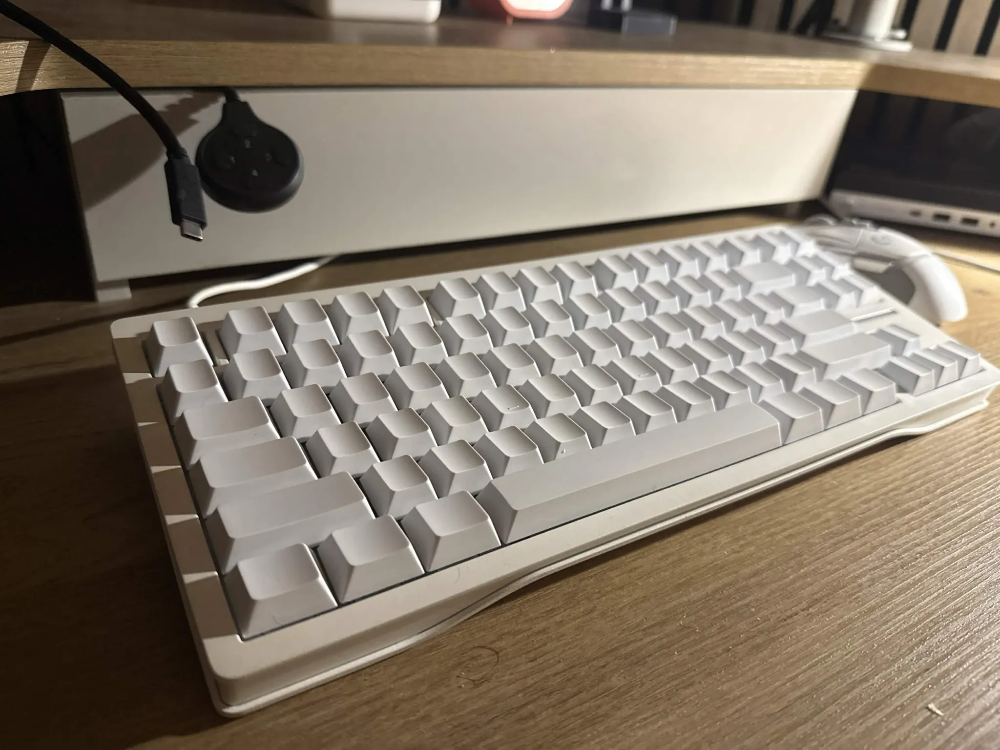
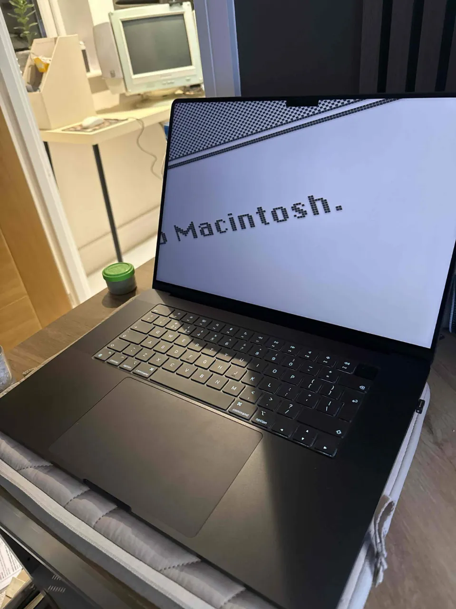

# WTF is wrong with modifier keys?
blah

## Preamble
1. I have 3 keyboards.
2. I travel between my home and the office
3. I use Linux and Mac.

Here's the keyboards, where I use them, and when I use them:

| Wooting 80HE                              | Standard MacBook built-in keyboard        | HHKB Hybrid Type-S                        |
| ----------------------------------------- | ----------------------------------------- | ----------------------------------------- |
| Home                                      | Travel                                    | Office                                    |
| Linux, Mac                                | Mac                                       | Mac                                       |
|  |  |  |

---

Before you accuse me of larp, and also buying needlessly expensive keyboards:
1. I got all of them for free.
2. I use them an equal amount.

It's not for show!

Until this week though, when moving between machines, I had to feel around and make the same 10~ stupid mis-inputs before I could copy a line of text. After about 8 months of putting up with this, I decided to sit down and actually look at why this is so bad. I already knew it was worse than "the keys are in different places" - I had an existing setup that worked well enough for me not to get *super* confused, but by no means was it perfect.

## macOS has three modifiers and three jobs

This is the bit I prefer about Apple:

- **Cmd** is the *application* modifier. Copy, paste, quit, close, save, find, new tab. If it's a thing an app does, it's Cmd.
- **Ctrl** is the *terminal* modifier. Control codes. `^C`, `^D`, `^Z`. It has almost no other job - it's basically vestigial outside a terminal.
- **Option** is the *text* modifier. Word-wise navigation, alt characters.

Three modifiers, three clean jobs, no overlap. Cmd+C copies *everywhere*, terminal included, because interrupting a program was never Cmd's job in the first place.
